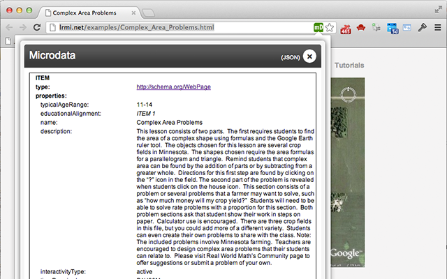

microdata.reveal
================

A Chrome browser extension to display embedded microdata to the user.

## Description ##

This extension will parse the currently loaded page, and indicate by the colour of the icon whether the page contains [HTML microdata](http://www.w3.org/TR/microdata/) (green) or whether it contains no microdata (grey).

By clicking on the icon, a popup is displayed showing a tabular view of the microdata, similar to [Google's Rich Snippets tool](http://www.google.com/webmasters/tools/richsnippets).

The user can also choose to see a JSON representation of the microdata.

The code for this extension is available at [https://github.com/cwa-lml/microdata.reveal](https://github.com/cwa-lml/microdata.reveal)

